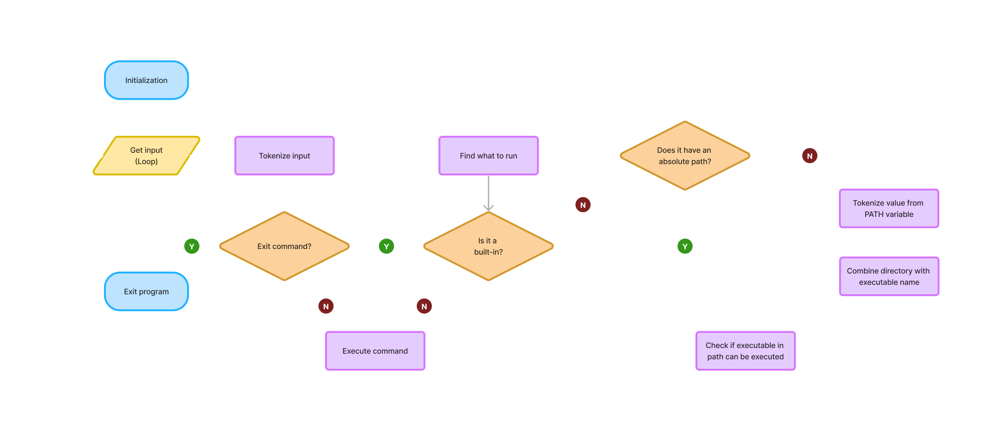

# Shelly


## SYNOPSIS

Shelly is a simple UNIX command interpreter written in C language. 

## DESCRIPTION

A prompt is displayed and then waits for the user to type a command. A command line always ends with a new line. The prompt will display anew each time a command has been executed. The command lines are simple—no semicolons, no pipes, no redirections or any other advanced features. The command can be made up multiple arguments. The first argument is the executable or built-in function the user wishes to use, and additional arguments will act as parameters specified for the first. If an executable cannot be found, an error message will print and display the prompt again. It will handle errors. If no text is entered following a new prompt, the user can exit by pressing Ctrl+D.

Shelly works similarly to sh, bash, and other basic shells.

The shell is compiled using an Ubuntu 22.04 LTS machine with: 
gcc -Wall -Werror -Wextra -pedantic -std=gnu89

## BUILT-INS

| **Built-ins** | **Result** |
| ----- | --------------------------- |
| env | Prints the environmental variables  |
| exit | Exits the shell |

## RETURN VALUE

Shelly will run with a return value of 0, or a 1 if command failed.

## USAGE

Shelly can be run interactively or non-interactively.  
In interactive mode, the "$" prompt is printed and then waits for user input.  
In non-interactive mode, the prompt is not printed and input is processed immediately.

### Example invocation

An interactive mode example:

    $ ls -l /usr/local

To run in non-interactive mode, the user could instead, for example, pipe in commands when launching Shelly from another shell:

    $ echo "ls -l /usr/local" | ./hsh

In both examples, this returns something along the following:
```
total 32
drwxr-xr-x 2 root root 4096 Mar 31 21:27 bin
drwxr-xr-x 2 root root 4096 Mar  8  2023 etc
drwxr-xr-x 2 root root 4096 Mar  8  2023 games
drwxr-xr-x 2 root root 4096 Mar  8  2023 include
drwxr-xr-x 3 root root 4096 Mar  8  2023 lib
lrwxrwxrwx 1 root root    9 Mar  8  2023 man -> share/man
drwxr-xr-x 2 root root 4096 Mar  8  2023 sbin
drwxr-xr-x 8 root root 4096 Mar 23 14:16 share
drwxr-xr-x 2 root root 4096 Mar  8  2023 src
```

## FLOWCHART


